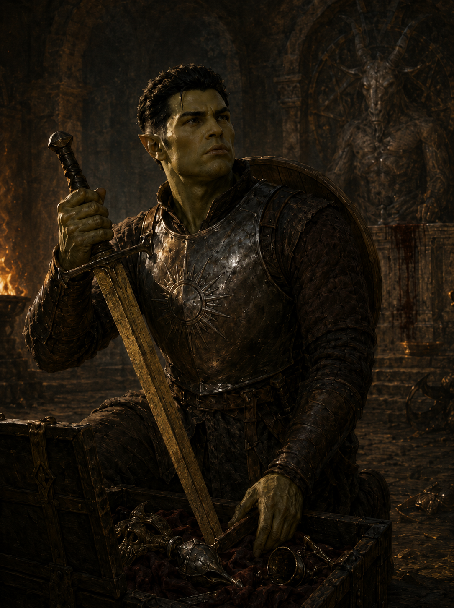
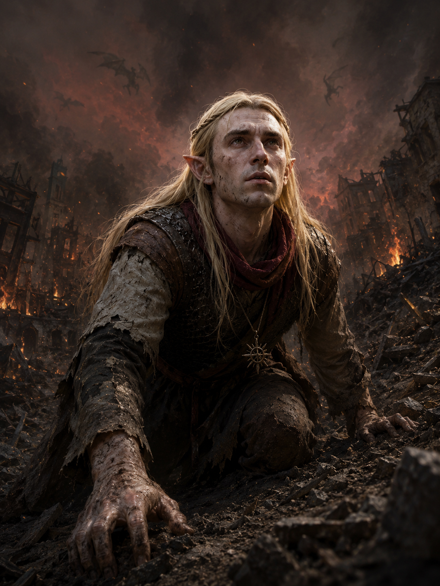
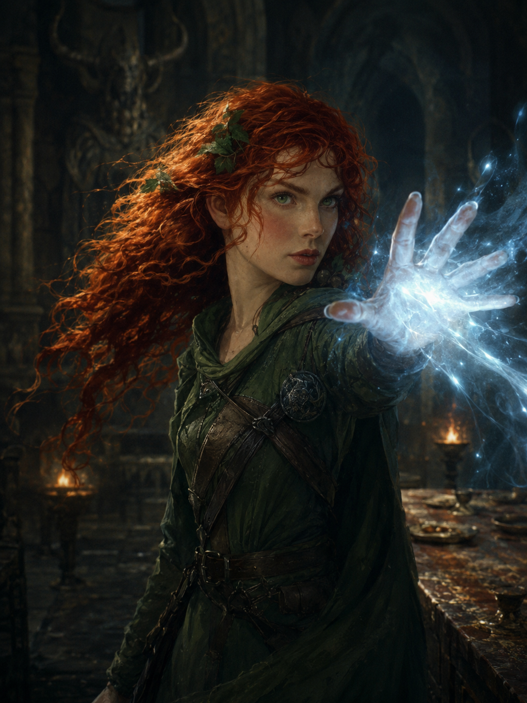

# Kit & Timeline — how the company looks, era by era

Companion to [`../characters/CANON.md`](../characters/CANON.md). The two files split one job:

- **`CANON.md` fixes identity** — the face, build, coloring, and species markers that
  **never change**. Take the likeness from there, always.
- **This file tracks gear** — armor, weapons, holy symbols, and relics **change as the
  story advances**. This is the authority for *what a character is wearing and wielding
  at a given point in the story*.

When you illustrate a scene: **face from `CANON.md`, kit from the matching era below.**
Where an era block and an old inline note in `CANON.md` disagree, **this file wins** — and
fix the `CANON.md` note.

## How to use

1. Find the **era** of the scene (by book/chapter, or the in-game moment).
2. Pull the character's **face/likeness** from `CANON.md`.
3. Pull their **gear** from that era's block here, and put its explicit negatives in the
   prompt's `Avoid:` line (e.g. early-era Harlock: `no golden plate, no glowing sword`).
4. If a scene sits *between* eras, use the **earlier** kit unless the chapter's text says
   the upgrade has already happened.

---

## Era I — The Deep Beneath Kenabres  *(Book I, early)*

**Covers:** the demon-fall through the company's climb out of the undercity and the first
fight for the ruined city — roughly Chapters I–IV. **Almost every early Book I scene shares
this look**, so get it right once and reuse it.

**The shared look.** Four (later five) strangers, newly met, exhausted and **poorly
equipped**. Everything is battered, scavenged, travel-worn, and **smeared with dust, ash,
and grime** from the sunless warrens. Nothing gilded, nothing ceremonial, no fine filigree.
Dim underground light; later, the ember-glow of the burning city. The *one* exception to the
grime is Rabiah (see below).

**Weapons were fluid this era — do NOT fix them here.** Good pieces weren't recovered until
later; early on the company fought with whatever they had — a glaive, a hammer, a borrowed
blade, a crossbow. The per-character blocks below fix **armor and signature gear only**;
**take each character's weapon from the specific scene's text**, and we'll note them
scene by scene as needed. The only weapons that become fixed *once acquired* are called out
inline (Harlock's *Radiance*, from its recovery onward; Lupenor's bow, her constant).

### Harlock Greyforge

- **Armor:** a plain, battered **steel breastplate bearing Iomedae's sunburst** over a
  padded gambeson. **NO pauldrons, gauntlets, greaves, or filigree. NO golden plate** —
  that is his much-later look.
- **Shield:** a basic **scavenged wooden shield** (unnamed; the sunburst is Iomedae's
  device, not a relic).
- **Weapon:** **fluid before the middle of Ch. IV** — in the earliest undercity scenes he
  fights with whatever he has (a glaive, a hammer, a plain sword); take it from the scene.
- **Radiance:** he bears it **from "Radiance Reclaimed" (Book I, Ch. IV) onward** — a **dull,
  dark, tarnished-gold longsword that gives off NO light**, dimmed and silent. It stays
  lightless through Ch. V. **It AWAKENS at "The Kindling of Radiance" (Book I, Ch. VI)**,
  where holy light first climbs the blade as Harlock speaks his oath — **from Ch. VI onward
  Radiance can blaze with gold-white holy light.**

### Varic Sarian

- **Armor:** a humble Sarenrae priest, **not** the resplendent later look — a plain,
  battered **chain shirt or padded leather over simple travel robes**, ash-smeared.
- **Marks of faith:** a **deep-red scarf** at the throat; a **plain iron sunburst holy
  symbol** of Sarenrae on a cord.
- **NO gold circlet, NO gold-filigree breastplate, NO ornate armor.**
- **Weapon:** fluid this era — take it from the scene. *Solemn Hour* (Irabeth's recovered
  blade, passed to him by Lupenor) and later *Battle Hymn* are **LATER** acquisitions.

### Rabiah

- **Clothes:** layered **green hooded traveling clothes** — and, true to her nature,
  **always neat, whole, and uncannily clean even here** (she keeps herself tidy with
  habitual little cantrips of prestidigitation). **She is the one character whose gear is
  NOT grimy in the deep** — the contrast is the point.
- **Gear:** a **leather baldric across the chest with the round dark metal medallion** at
  the shoulder.
- **A young sorcerer: no armor.** Her power comes from the hand, not the blade — any
  weapon she carries (a wand, a light crossbow) is incidental and **per scene**.

### Lupenor Celest  *(no dedicated Era I exemplar yet)*
- *Drafted from `CANON.md` + existing early art — confirm early specifics:* a **high-collared
  dark-green tunic with a steel pauldron** at the shoulder, practical and covered; a
  **longbow** and a **quiver of fletched arrows**. Travel leathers, no fine gear.
- **Weapon:** the bow is her constant; any melee sidearm is **per scene**.

### Chirrik  *(joins mid-Book I, not in the earliest undercity scenes)*
- **Grey-green hooded travel leathers**, wrapped forearms; a **long horn bow** and a quiver
  of **black-fletched arrows**. Met on the road — absent from the first deep-cavern scenes,
  so do not place her in Chapters I–III.

---

## Later eras — to be filled in as the story reaches them

Add a new era block each time the company meaningfully re-equips, and carry each character's
kit forward. Things that belong to **later** eras, **not** Era I:

- **Harlock:** ornate **golden full plate**; **Radiance awakened** and blazing with holy
  light (it wakes when he speaks his oath at Defender's Heart — after the undercity).
- **Varic:** the **gold-filigree breastplate, gold circlet, red mantle**, and steel
  pauldrons of his resplendent look; **Solemn Hour**, later **Battle Hymn**.
- **Lupenor / Rabiah / Chirrik:** upgrades won at the Gray Garrison, Drezen, and beyond.

*(Suggested next era to define once needed: **Era II — The Gray Garrison & the March**.)*

---

## Reconcile — existing art that predates this guide

Two early Book I images were made **before** Varic's humble Era I kit was settled, and show
him **already gilded**, inconsistent with Era I above:

- [`../images/the-mongrels-of-the-deep.png`](../images/the-mongrels-of-the-deep.png)
- [`../images/the-host-of-sorrowful-stone.png`](../images/the-host-of-sorrowful-stone.png)

**Decision pending (Matt):** regenerate these two to the humble kit, or accept the drift.
