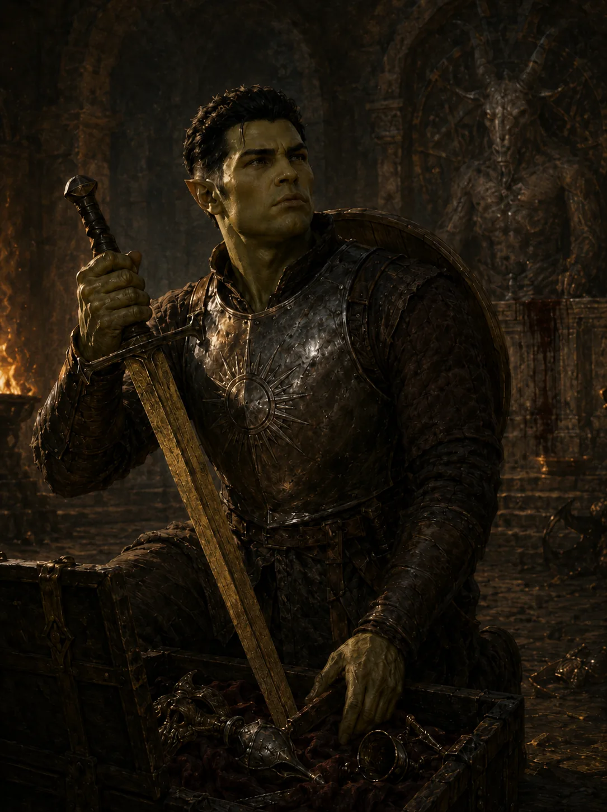
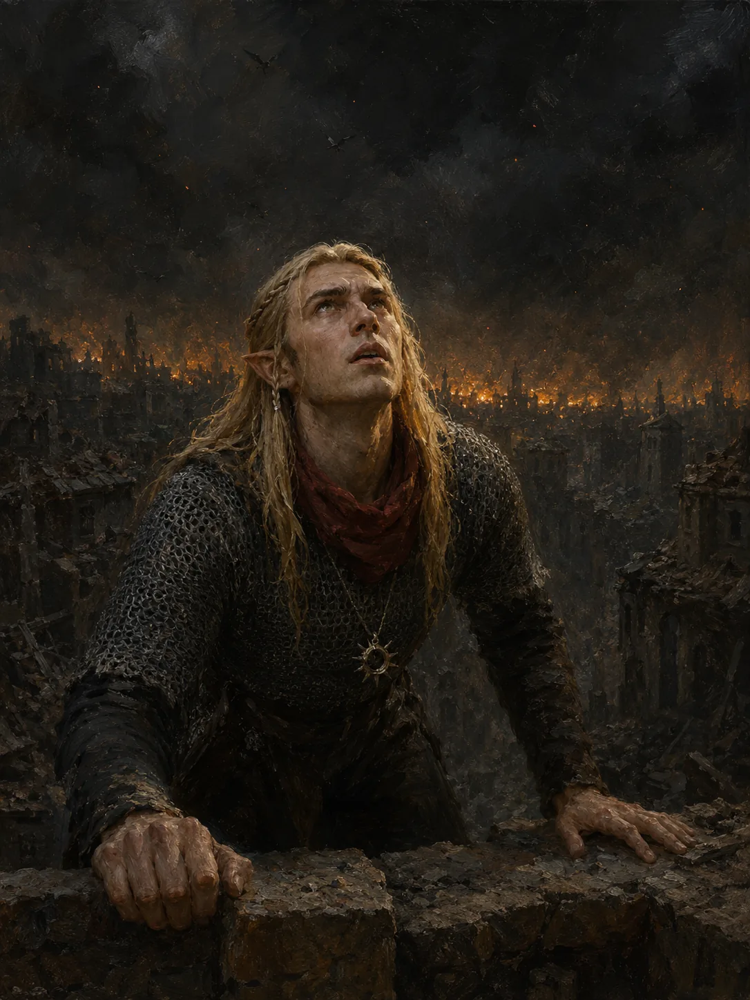
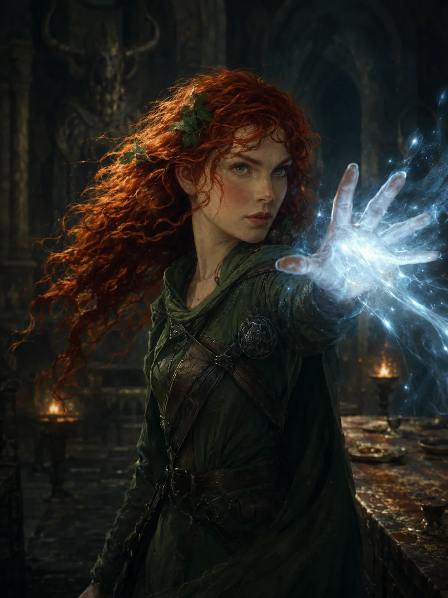

# Kit & Timeline — how the company looks, era by era

Companion to [`../characters/CANON.md`](../characters/CANON.md). The two files split one job:

- **`CANON.md` fixes identity** — the face, build, coloring, and species markers that
  **never change**. Take the likeness from there, always.
- **This file tracks gear** — armor, weapons, holy symbols, and relics **change as the
  story advances**. This is the authority for *what a character is wearing and wielding
  at a given point in the story*.

When you illustrate a scene: **face from `CANON.md`, kit from the matching era below.**
Where an era block and an old inline note in `CANON.md` disagree, **this file wins** — and
fix the `CANON.md` note.

## How to use

1. Find the **era** of the scene (by book/chapter, or the in-game moment).
2. Pull the character's **face/likeness** from `CANON.md`.
3. Pull their **gear** from that era's block here, and put its explicit negatives in the
   prompt's `Avoid:` line (e.g. early-era Harlock: `no golden plate, no glowing sword`).
4. If a scene sits *between* eras, use the **earlier** kit unless the chapter's text says
   the upgrade has already happened.

---

## Era I — The Deep Beneath Kenabres  *(Book I, early)*

**Covers:** the demon-fall through the company's climb out of the undercity and the first
fight for the ruined city — roughly Chapters I–IV. **Almost every early Book I scene shares
this look**, so get it right once and reuse it.

**The shared look.** Four (later five) strangers, newly met, exhausted and **poorly
equipped**. Everything is battered, scavenged, travel-worn, and **smeared with dust, ash,
and grime** from the sunless warrens. Nothing gilded, nothing ceremonial, no fine filigree.
Dim underground light; later, the ember-glow of the burning city. The *one* exception to the
grime is Rabiah (see below).

**Weapons were fluid this era — do NOT fix them here.** Good pieces weren't recovered until
later; early on the company fought with whatever they had — a glaive, a hammer, a borrowed
blade, a crossbow. The per-character blocks below fix **armor and signature gear only**;
**take each character's weapon from the specific scene's text**, and we'll note them
scene by scene as needed. The only weapons that become fixed *once acquired* are called out
inline (Harlock's *Radiance*, from its recovery onward; Lupenor's bow, her constant).

### Harlock Greyforge

- **Armor:** a plain, battered **steel breastplate bearing Iomedae's holy symbol — a
  vertical sword, point down, in front of a blazing sun** — over a padded gambeson.
  **NO pauldrons, gauntlets, greaves, or filigree. NO golden plate** — that is his
  much-later look. The sword-and-sun is on his chest in **every** era; only the armor
  under it changes.
- **Shield:** a basic **scavenged wooden shield**, likewise blazoned with the
  sword-and-sun (unnamed; the device is Iomedae's, not a relic). **He carries this only
  through Era I — it is replaced in the Book I Epilogue; see Era II.**
- **Weapon:** **fluid before the middle of Ch. IV** — in the earliest undercity scenes he
  fights with whatever he has (a glaive, a hammer, a plain sword); take it from the scene.
- **Radiance:** he bears it **from "Radiance Reclaimed" (Book I, Ch. IV) onward** — a **dull,
  dark, tarnished-gold longsword that gives off NO light**, dimmed and silent. It stays
  lightless through Ch. V. **It AWAKENS at "The Kindling of Radiance" (Book I, Ch. VI)**,
  where holy light first climbs the blade as Harlock speaks his oath — **from Ch. VI onward
  Radiance can blaze with gold-white holy light.**

### Varic Sarian

- **Armor:** a humble Sarenrae priest, **not** the resplendent later look — a plain,
  battered **chain shirt or padded leather over simple travel robes**, ash-smeared.
- **Marks of faith:** a **deep-red scarf** at the throat; a **plain iron sunburst holy
  symbol** of Sarenrae on a cord.
- **NO gold-filigree breastplate, NO ornate armor.**
- **Weapon:** fluid this era — take it from the scene. *Solemn Hour* (Irabeth's recovered
  blade, passed to him by Lupenor) and later *Battle Hymn* are **LATER** acquisitions.

### Rabiah

- **Clothes:** layered **green hooded traveling clothes** — and, true to her nature,
  **always neat, whole, and uncannily clean even here** (she keeps herself tidy with
  habitual little cantrips of prestidigitation). **She is the one character whose gear is
  NOT grimy in the deep** — the contrast is the point. **One sanctioned exception:**
  [`../images/the-freeing-of-anevia.webp`](../images/the-freeing-of-anevia.webp), the very
  first hour after the demon-fall, where she is as filthy as everyone else — nobody is
  thinking about cantrips yet, and she has just hauled a stranger out of the rubble with
  her bare arms. **Scene-specific. Do not carry it forward** — she is spotless everywhere
  else, including later in the same chapter.
- **Gear:** a **leather baldric across the chest with the round dark metal medallion** at
  the shoulder.
- **A young sorcerer: no armor.** Her power comes from the hand, not the blade — any
  weapon she carries (a wand, a light crossbow) is incidental and **per scene**.

### Lupenor Celest  *(no dedicated Era I exemplar yet)*
- *Drafted from `CANON.md` + existing early art — confirm early specifics:* a **high-collared
  dark-green tunic with a steel pauldron** at the shoulder, practical and covered; a
  **longbow** and a **quiver of fletched arrows**. Travel leathers, no fine gear.
- **Weapon:** the bow is her constant; any melee sidearm is **per scene**.

### Chyrrik  *(joins mid-Book I, not in the earliest undercity scenes)*
- **Grey-green hooded travel leathers**, wrapped forearms; a **long horn bow** and a quiver
  of **black-fletched arrows**. Met on the road — absent from the first deep-cavern scenes,
  so do not place her in Chapters I–III.

---

## Era II — Arms Inherited  *(Book I, Epilogue onward)*

**Begins at:** *Let Us Inherit Thine Arms* — the hidden shrine-vault behind the altar in the
Gray Garrison, opened in the Book I Epilogue. Everything before that scene is Era I; everything
after it, until the company next re-equips, is Era II.

Era I still governs the rest of the look — the company is battered, campaign-worn, and a long
way from gilded. Only what is listed here has changed.

### Harlock Greyforge
- **Shield — CHANGED.** The scavenged wooden shield is gone. From the vault he takes a
  ***steel shield of blinding***: **the large, richly-worked shield seen in his canonical
  portrait** ([`../characters/harlock.webp`](../characters/harlock.webp)) — substantial, metal,
  finely bordered — blazoned across its face with **Iomedae's holy symbol: a vertical sword,
  point down, in front of a blazing sun.** Being a shield *of blinding*, it may catch and throw
  a hard flare of light when the scene calls for it; at rest it is simply a fine steel shield.
  **Avoid:** `scavenged wooden shield, plank shield, a bare starburst with no sword`.
- **Armor — unchanged, and this matters.** Still the plain battered breastplate with the
  sword-and-sun over a padded gambeson, and **padded cloth everywhere else**. **NO pauldrons,
  NO gauntlets, NO greaves, NO filigree, NO golden full plate.** He took a shield from that
  vault and nothing else. **Avoid:** `steel pauldrons, shoulder armour, gauntlets, greaves,
  golden full plate`.
  *(Accepted drift: [`../images/the-march-of-the-glowing-ones.webp`](../images/the-march-of-the-glowing-ones.webp)
  gives him steel pauldrons. Matt has let that one slide; it is not a kit change, and new art
  goes back to bare shoulders over the gambeson.)*
- ***Radiance* — unchanged.** Awakened since Ch. VI; a golden longsword that can blaze with
  gold-white holy light.

### The rest of the company
The vault also yielded pristine mail, quivers stamped with the golden sign, and silver shields,
most of which the company resolved to give over to the Crusade rather than keep. **Only
Harlock's shield is settled canon so far** — if Lupenor, Rabiah, or Varic took anything from
that vault, ask Matt and add it here before illustrating it.

---

## Era III — The March to Drezen  *(Book II)*

**Begins at:** *A Queen's Commission* (Book II, Ch. II), and runs through the march, the
canyon, and the siege of **Drezen**.

**Derived from the shipped art, not from a prior guide entry.** This block was written after
the fact by reading the Book II images themselves — [`../images/the-bargain-at-the-gwerm-estate.webp`](../images/the-bargain-at-the-gwerm-estate.webp),
[`../images/the-arm-that-held-them.webp`](../images/the-arm-that-held-them.webp),
[`../images/the-column-of-cloud.webp`](../images/the-column-of-cloud.webp),
[`../images/he-is-a-paladin-now.webp`](../images/he-is-a-paladin-now.webp) — which agree with each
other. Where a new Book II image disagrees with this block, the block is wrong; fix it here.

### Varic Sarian — **still not gilded, and this is the one that keeps drifting**
- **Armor:** a dark, travel-worn **mail shirt with mail sleeves** over dark wool. Practical and
  campaign-worn.
- **Marks of faith:** the **deep-red scarf** at the throat; a **plain gold or brass sunburst of
  Sarenrae on a cord** at the chest — a bare stylized sun, **no sword in front of it** (that is
  Iomedae's device, and Harlock is usually in the same frame).
- **Hair:** long and straight, worn loose, with a small braid at the temple.
- **NO gold-filigree breastplate, NO red mantle, NO ornate pauldrons.** His
  canonical portrait shows the resplendent look; that is **later than Book II**. Take his face
  from the portrait and his kit from here.
- **Avoid:** `gold-filigree breastplate, red mantle, a sword in front of the sun`.
- ⚠️ **Do NOT police a "gold circlet" on Varic — in any era. See *The circlet is not a fault* below.**

### Harlock Greyforge
- **Armor — unchanged from Era II.** The plain, battered **steel breastplate over a padded
  gambeson**, bearing **Iomedae's sword-and-sun**. No golden plate, no filigree.
  *(Accepted drift: the Book II art gives him **armoured sleeves / vambraces** rather than bare
  gambeson sleeves — see `the-column-of-cloud` and `he-is-a-paladin-now`. Matt has let this
  stand, as with `the-march-of-the-glowing-ones`. Large pauldrons and golden plate are still out.)*
- **Shield:** the ***steel shield of blinding*** from the Book I vault, blazoned with the
  sword-and-sun.
- ***Radiance*:** awakened — a golden longsword that blazes with gold-white holy light, and is
  usually the single luminous accent of any frame it appears in.

### Lupenor Celest
- The **high-collared dark-green tunic** with a **steel pauldron** at the shoulder, practical and
  fully covered; **longbow** and a quiver of fletched arrows at her back.

### Rabiah
- The **green hooded cloak** thrown back over a high-necked green tunic and long sleeves; the
  **leather baldric with the round dark metal medallion** at the shoulder. **Neat, whole and
  uncannily clean**, however filthy the scene around her — this holds through Book II.

---

## Era IV — The Golden Plate  *(Book II, from "The Citadel's Gauntlet" onward)*

**Begins at:** *The False Shrine* (Book II, Ch. XII, "The Citadel's Gauntlet") — the mimic-trap
shrine inside Citadel Drezen. Of the four masterwork mannequins in that room, one suit was gold
and lettered in celestial script, and hummed with abjuration. **Harlock claimed it for his own**
once the shrine's mimics were dead. Everything else in Era III still holds; only Harlock's body
armor changes here.

### Harlock Greyforge — **CHANGED: this is the later look from `characters/harlock.webp`**
- **Armor — upgraded.** The plain battered breastplate and gambeson are retired. From this scene
  onward he wears the **ornate golden full plate** seen in his canonical portrait: shaped
  gold-and-steel plates with fine engraved scrollwork, full pauldrons, gauntlets, and greaves.
  Take the armor design directly from `characters/harlock.webp`.
- **Shield — unchanged.** Still the ***steel shield of blinding*** from the Book I vault,
  blazoned with the sword-and-sun — the portrait shows it re-gilded to match the new armor, which
  is consistent, not a separate item.
- ***Radiance* — unchanged.** Awakened, and blazes with gold-white holy light.
- **Avoid (for any Ch. XII-onward scene):** `plain steel breastplate, padded gambeson, bare
  gambeson sleeves, battered campaign-worn armor` — that look is retired as of this era.

### Varic Sarian — ***Solemn Hour*** changes hands here
- **Armor — unchanged.** Still the dark travel-worn mail shirt with mail sleeves, the deep-red
  scarf, and the plain gold or brass sunburst of Sarenrae. **Still not gilded** — no
  filigree breastplate, no mantle. *(On the gold band that keeps appearing in his hair, see
  **The circlet is not a fault** below: it is his temple braid and it is not a defect.)*
- **Weapon — CHANGED.** ***Solemn Hour*** — **Irabeth Tirabade's** recovered longsword, a bane
  weapon against evil outsiders — was carried by **Lupenor** through the fall of Staunton Vhane,
  and it is the reason Staunton killed her: it was Irabeth who exposed him, and he came into that
  room shouting for her sword. **Lupenor handed it to Varic during the downtime immediately
  afterward** (Book II, Ch. XV) and took up a warhammer for her own melee work. From that point on
  **Varic** is the one carrying *Solemn Hour*.
- He also carries a **round wooden-and-iron shield** and, as a priest, an **aspergillium** — a
  plain metal rod ending in a hollow perforated sphere for sprinkling holy water. **Describe the
  aspergillium physically in any prompt; the word alone renders as a mace or a censer on chains.**

---

## Era V — Varic in Plate  *(Book II, from "Into the Dungeons Beneath Drezen" onward)*

**Begins at:** Book II, Ch. XVI, in the specter corridor beneath Citadel Drezen. Varic went down
those stairs in a suit of **spiked full plate**, was drained by a specter within minutes of meeting
one, and — with **Harlock**'s help — stripped it off in the corridor and put on the **ghost-touch
full plate** he had been carrying and not wearing. He does not go back. Everything else in Era IV
still holds; only Varic changes here.

### Varic Sarian — **CHANGED: he is in full plate from here on**
- **Armor — upgraded, and this supersedes the Era III/IV "still not gilded" note for all scenes
  from Ch. XVI onward.** He now wears **full plate**, and the design is taken from his canonical
  portrait [`../characters/varic.webp`](../characters/varic.webp): a shaped **gold-and-steel
  breastplate with fine red-and-gold filigree scrollwork**, **steel pauldrons on BOTH shoulders**,
  plate vambraces and legs, **chainmail visible beneath** at the sleeves and skirt. Render it
  **campaign-worn — scratched, dirty, fought-in — never parade-bright.**
- **Marks of faith — unchanged.** The **deep-red scarf** at the throat, and the plain gold-brass
  **sunburst of Sarenrae** on a cord: a bare stylized sun, **no sword in front of it** (that is
  Iomedae's device, and Harlock is usually in the same frame).
- **Still no mantle.** The portrait's **red mantle is NOT part of
  this change** — Matt's direction was the *armor* from the portrait, not the shoulders.
- ***Solemn Hour*** — unchanged, carried from Ch. XV.
- **Avoid (for any Ch. XVI-onward scene):** `a mail shirt, a bare mail shirt with no plate, cloth
  robes, leather armor, a red mantle or cloak, parade-bright polished armor`.

*The ghost-touch property is invisible; it changes nothing about how the suit is drawn.*

### The circlet is not a fault — stop flagging it

**Matt's ruling, Aug 2026.** Earlier versions of this guide put `a gold circlet or crown` in Varic's
`Avoid:` line in every era, and every QA pass then "found" one. **It was a false positive every
time.** Varic has **yellow-gold hair** and wears **braids at his temple to keep it back** — that
combination reads as a thin gold band in almost any render, at almost any resolution, and no prompt
wording prevents it because there is nothing to prevent: it is his hair.

**So: do not put circlet negatives in Varic's prompts, and do not report a circlet as a drift at
QA.** It cost real review cycles and attention on the Book III Ch. VIII art and bought nothing.
The things that *do* matter on his head and shoulders are the **deep-red scarf** (present in every
era, and genuinely worth checking) and the **red mantle/cloak** (portrait-only, genuinely worth
excluding). The band in his hair is neither.

### Varic off duty — the one sanctioned exception to the plate

**Matt's direction, Aug 2026** (drafting the Book III Ch. IV supper with **Irabeth** and **Anevia**).
The Era V plate is what he *campaigns* in, and it holds for every scene in the field, on the march,
in a fight, or on duty. **For a genuinely private, off-duty scene behind friendly walls — a supper,
a quiet evening indoors, a conversation with no expectation of trouble — he is out of armour.**

- **Plain dark travel wool:** a high-necked, long-sleeved tunic in undyed dark brown-grey, fully
  covering, worn and mended. **No metal on him anywhere** — no breastplate, no mail, no pauldrons,
  no gauntlets.
- **Unchanged and always present:** the **deep-red scarf** at the throat, and the plain gold-brass
  **sunburst of Sarenrae** on a cord — a bare stylised sun, **no sword in front of it.**
- **Still no red mantle or cloak.** That is portrait-only in every era. *(The gold band in his
  hair is his temple braid — see **The circlet is not a fault** above. Do not flag it.)*
- **Avoid:** `a breastplate, plate armour, mail, pauldrons, gauntlets, a red mantle or cloak`.

### Irabeth off duty — she does not dine in her plate

**Matt's correction, Aug 2026**, on the same supper. This row previously said Irabeth *stays* in her
battered plate at that table. **That was wrong.** At a private dinner behind her own walls she is out
of armour like everyone else.

- **Plain but well-made dark wool** — a high-necked, long-sleeved tunic or doublet in a deep muted
  colour (oxblood, dark blue-grey), fully covering, with a broad plain leather belt. Soldier's
  clothes off duty: honest and unadorned, but a commander's, not a labourer's. **No armour of any
  kind** — no plate, no mail, no pauldrons, no gauntlets.
- **The device still travels with her.** **Iomedae's** holy symbol on a plain chain at her throat: a
  vertical sword hanging **point down — hilt and crossguard at the TOP, blade below, tip at the
  bottom** — in front of a blazing sun; plain engraved silver, one pommel, one straight crossguard,
  not glowing, not a crucifix. The armour comes off; the sword-and-sun never does.
- **Avoid:** `plate armour, mail, a breastplate, pauldrons, gauntlets, a bare starburst with no
  sword, an inverted sword`.

**The general rule, now that two characters have one:** for a genuinely private, off-duty scene
behind friendly walls, the company is out of kit. **Ask Matt for anyone whose off-duty look is not
yet written down here, and add it when he answers.**

---

## Later eras — to be filled in as the story reaches them

Add a new era block each time the company meaningfully re-equips, and carry each character's
kit forward. Things that belong to **later** eras, **not** Era I:

- **Harlock:** ornate **golden full plate**; **Radiance awakened** and blazing with holy
  light (it wakes when he speaks his oath at Defender's Heart — after the undercity).
- **Varic:** the **gold-filigree breastplate, red mantle**, and steel
  pauldrons of his resplendent look; **Solemn Hour**, later **Battle Hymn**.
- **Lupenor / Rabiah / Chyrrik:** upgrades won at the Gray Garrison, Drezen, and beyond.

*(Suggested next era to define once needed: **Era II — The Gray Garrison & the March**.)*

---

## Reconcile — existing art that predates this guide

Two early Book I images were made **before** Varic's humble Era I kit was settled, and show
him **already gilded**, inconsistent with Era I above:

- [`../images/the-mongrels-of-the-deep.webp`](../images/the-mongrels-of-the-deep.webp)
- [`../images/the-host-of-sorrowful-stone.webp`](../images/the-host-of-sorrowful-stone.webp)

**Decision pending (Matt):** regenerate these two to the humble kit, or accept the drift.

**Harlock's holy symbol predates this rule.** The sword-and-sun device was settled only at the
Book I Epilogue. Every Harlock image made before it — the chest device in
[`../images/the-dimmed-blade.webp`](../images/the-dimmed-blade.webp),
[`../images/the-kindling-of-radiance.webp`](../images/the-kindling-of-radiance.webp),
[`../images/the-worm-wearers-at-the-threshold.webp`](../images/the-worm-wearers-at-the-threshold.webp)
and the rest of Book I — shows a **bare starburst with no sword**, or no legible device at all.

**Decided (Matt, July 2026): leave the prior art in place.** The bare starburst stands in the
existing Book I images; the sword-and-sun holds from the Book I Epilogue forward, and **all new
art carries it** without exception. Do not reopen this.
